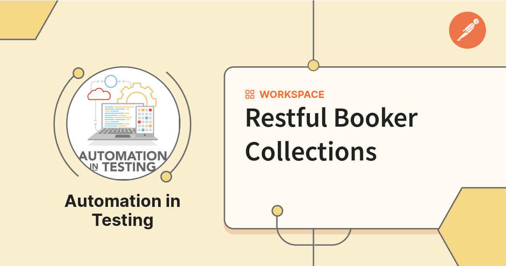

# 🌐 Restful Booker



Welcome to **Restful Booker**, a lightweight, powerful booking application that provides various RESTful services. This repository contains the full source code, setup instructions, and usage guide for your convenience.

---

## 📚 Table of Contents

- [✨ Introduction](#-introduction)
- [🚀 Features](#-features)
- [⚙️ Installation](#️-installation)
- [💡 Usage](#-usage)
- [🤝 Contributing](#-contributing)
- [📝 License](#-license)

---

## ✨ Introduction

**Restful Booker** is a simple yet efficient booking platform that offers users the ability to create, retrieve, update, and delete bookings securely through a REST API.

---

## 🎬 Examples of Run

Take a look at a local execution demo below!  


---

## 🚀 Features

✅ Create new bookings with details like name, price, dates, and additional needs  
✅ Retrieve individual bookings using a unique booking ID  
✅ Update existing bookings  
✅ Delete bookings with proper authentication  
✅ Secure operations with basic authentication  
✅ JSON-based requests & responses for easy integration  
✅ Clean and simple RESTful API endpoints

---

## ⚙️ How to Run the Project and Test It with Postman

To set up and run the **Restful Booker** project locally, and test it using **Postman**, follow these steps:

1. **Clone the repository**  
   Open your terminal or command prompt and run:
   ```bash
   git clone https://github.com/islamtoba/Restful_Booking_Project
   ```

2. **Navigate to the project directory**  
   ```bash
   cd Restful_Booking_Project
   ```

3. **Install dependencies**  
   Make sure you have [Node.js](https://nodejs.org/) installed. Then, install the project dependencies:
   ```bash
   npm install
   ```

5. **Import the Postman collection**  
   - Open [Postman](https://www.postman.com/)
   - Click on **"Import"** and upload the Postman collection file from the project folder  
     (look for a file like `Restful_Booker_Collection.json`)
   - Also import the environment file if available  
     (e.g., `Restful_Booker_Environment.postman_environment.json`)

6. **Set the correct environment in Postman**  
   - In Postman, choose the imported environment (e.g., `Localhost Environment`) from the top-right dropdown.

7. **Run the requests or the full test collection**  
   - Go to the imported collection
   - You can run individual requests or click **"Run Collection"** to execute the full test suite using the Collection Runner.

or click on run.bat becuse it's have the command that will run the collection and create report that you can find in newman folder.

---

## 💡 Usage

📘 **User Guide**: Refer to the User Guide for complete instructions on how to use the Restful Booker application efficiently.

---

## 🤝 Contributing

We ❤️ contributions from the community!  
To contribute:

1. **Fork** the repository  
2. **Create** a new branch for your feature or bug fix  
3. **Make** your changes  
4. **Submit** a pull request 🚀

---

## 📝 License

This project is licensed under the **MIT License**.  
Feel free to use, modify, and share it freely.

---

✨ Happy Booking!
